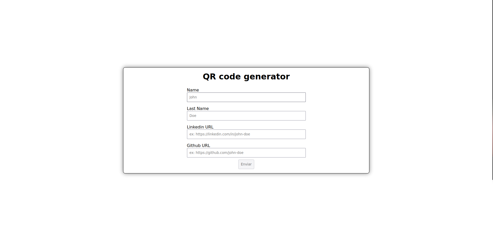

# QR CODE GENERATOR 📚

<details>
  <summary><h1>Tecnologias Usadas</h1></summary>

<h3>Front-End</h3>

  <div>
    
  </div>

<h3>Back-End</h3>

  <div>
    
  </div>

</details>
</h1>

<p align="center">
  
</p>

> Link da aplicação: <a href="https://desafio-tecnico-buzzvel.vercel.app/" target="_blank">QR Code Generator</a>

</br>

## 🖖🏼 Objetivo

Criar uma aplicação onde seja possível cadastrar informações de um usuário e gerar um QRCode automaticamente redirecionando
para uma página de perfil desse usuário

## ✔️ Funcionalidades

Projeto concluído ✅:

- [x] Criar cadastro com informações do usuário
- [x] Gerar um QRCode redirecionando para uma pagina de perfil
- [x] Criar uma pagina de perfil com as informações cadastradas pelo usuário

## 💻 Pré-requisitos

Antes de começar, verifique se você atendeu aos seguintes requisitos:

<!---Estes são apenas requisitos de exemplo. Adicionar, duplicar ou remover conforme necessário--->

- Ter instalado o nodeJs
- Verificar se não tem nenhum processo rodando na porta: <strong>5173</strong>
- Verificar se não tem nenhum processo rodando na porta: <strong>3333</strong>
- Ter o docker e o docker compose instalado
- Ter criado as variáveis de ambiente conforme é descrito nos arquivos de exemplos

## 🚀 Rodando localmente QR CODE GENERATOR

</br>

**Clone o repositório**

```shell
  git clone https://github.com/rms-diego/desafio-tecnico-buzzvel.git && cd desafio-tecnico-buzzvel
```

**Rodando os testes com o NPM OBS: CERTIFIQUE QUE AS VARIÁVEIS DE AMBIENTE FORAM CRIADAS ANTES DA CRIAÇÃO DA IMAGEM CONFORME O ARQUIVO DE EXEMPLO**

Caso esteja usando o plugin do docker compose

```shell
  npm run test
```

**Rodando localmente com Docker OBS: CERTIFIQUE QUE AS VARIÁVEIS DE AMBIENTE FORAM CRIADAS ANTES DA CRIAÇÃO DA IMAGEM CONFORME O ARQUIVO DE EXEMPLO**

Caso esteja usando o plugin do docker compose

```shell
  docker compose up
```

Caso esteja usando o docker compose standalone

```shell
  docker-compose up
```

## BACKEND ENDPOINTS

</br>

### Rota <strong>/user/create</strong>

É esperado um body no seguinte formato

```json
{
	"name": <string>,
	"linkedinUrl": <string>,
	"githubUrl": <string>
}
```

Caso a resposta seja feita com sucesso irá retornar um status code de 204 (no content)

exemplo de requisição

```shell
  curl -d '{"name":"John Doe", "linkedinUrl":"https://linkedin.com/in/john-doe", "githubUrl":"https://github.com/john-doe"}' -H "Content-Type: application/json" -X POST http://<endereço ip>:3333/user/create
```

Caso esteja faltando alguma informação no body a resposta da requisição sera essa, com o status code de 400 (Bad request)

```json
{
	"error": {
		"field": ..., // campo que está faltando
		"message": "Required"
	}
}
```

</br>

### Rota <strong>/user/findByName/:name</strong>

É esperado que o nome do usuário seja passado como parâmetro

```shell
  curl http://<endereço ip>:3333/user/findByName/john-doe
```

Resposta será seguindo esse padrão com o status code de 200

```json
{
  "user": {
    "id": <uuid>,
    "name": <string>,
    "githubLink": <string>,
    "linkedinLink": <string>
  }
}
```

</br>
</br>

### OBS: é possível enviar o nome como parâmetro com espaço ou com hífen, exemplo: <strong>/user/findByName/john doe </strong> ou <strong>/user/findByName/john-doe</strong>

</br>
</br>

Caso não seja enviado o nome como parâmetro ou tenha enviado um nome que não existe no banco de dados a resposta será como essa, com o status code de 404

```json
{
  "error": "User does not exists"
}
```
